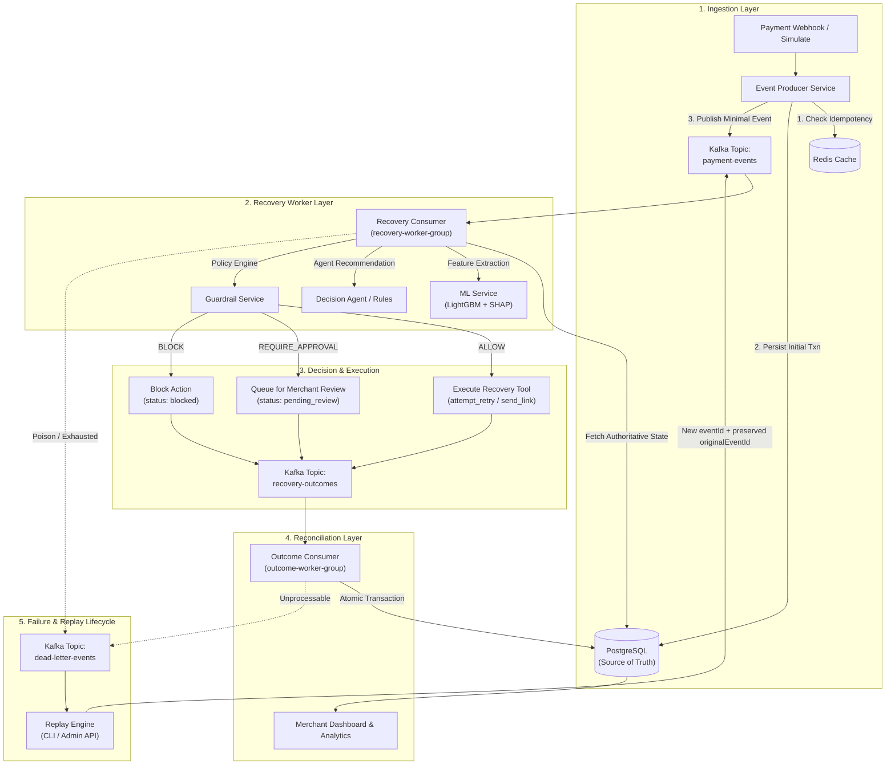
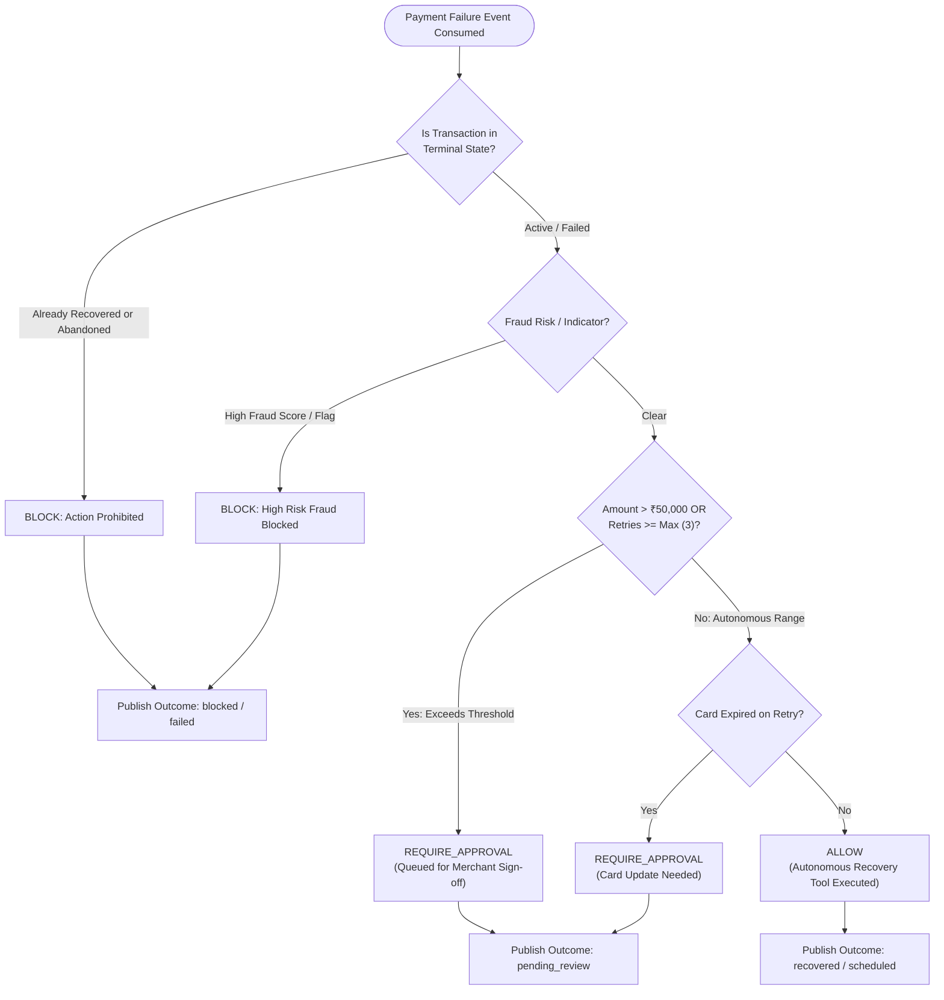
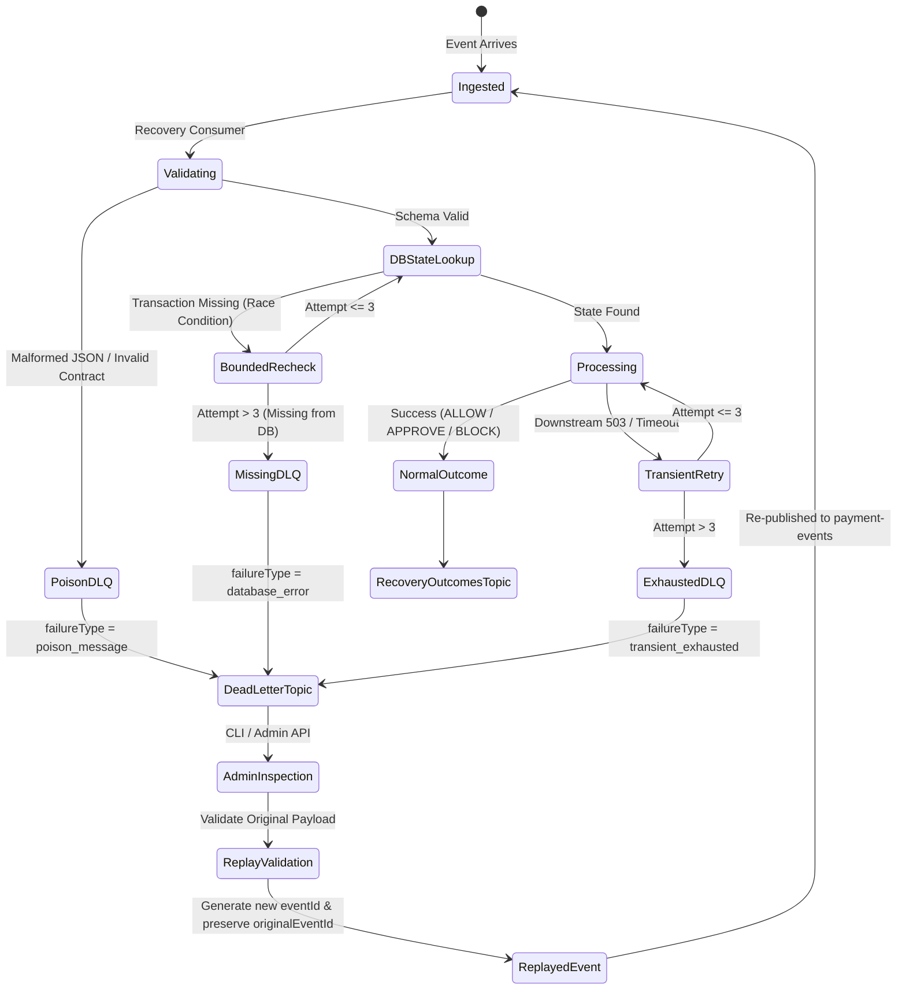

# RecoverIQ — Autonomous Payment & Subscription Recovery Platform

RecoverIQ is an enterprise B2B merchant-side payment and subscription recovery platform. It transforms synchronous payment failure handling into an asynchronous, **event-driven architecture using Apache Kafka (Redpanda)**, powered by machine learning recovery scoring, agentic diagnosis, strict policy guardrails (`ALLOW` / `REQUIRE_APPROVAL` / `BLOCK`), and automated dead-letter queue (DLQ) replay capabilities.

---

## 🏗️ System Architecture

RecoverIQ decouples high-throughput payment webhook ingestion from downstream recovery execution, using Apache Kafka as the durable event backbone while preserving PostgreSQL as the authoritative source of truth.



---

## ⚡ Kafka Architecture & Topics

Kafka acts as the **event backbone and transport layer**; PostgreSQL remains the immutable **source of truth**.

| Kafka Topic | Consumer Group | Partitioning Key | Purpose |
|---|---|---|---|
| **`payment-events`** | `recovery-worker-group` | `transactionId` | Ingestion stream for normalized payment/subscription failure events. |
| **`recovery-outcomes`** | `outcome-worker-group` | `transactionId` | Stream of recovery execution results, scheduled retries, and review requests. |
| **`dead-letter-events`** | Admin / Tools | `transactionId` or `eventId` | Diagnostic dead-letter queue for poison messages, schema violations, and exhausted retries. |

### Key Invariants
- **No Customer PII in Kafka**: Events contain only opaque identifiers (`transactionId`, `customerId`, `caseId`, `eventId`) and payment metadata. Full customer details (names, emails, phones) are resolved directly from PostgreSQL in worker consumers.
- **`eventId`-Level Idempotency**: Deduplication uses unique `eventId` keys in Redis to ensure duplicate deliveries are safely ignored without skipping legitimate multiple attempts for a single transaction.
- **Manual Offset Commits**: Offsets are committed only *after* successful processing or confirmed routing to DLQ, guaranteeing zero message loss and preventing consumer partition stalls.

---

## 🔄 Recovery Decision Flow

Every recovery action recommended by ML or Agent heuristics is evaluated against strict backend security guardrails before execution:



---

## 🛡️ Dead-Letter Queue (DLQ), Retry & Replay

### Error Classification & Retry Policy
1. **Permanent / Poison Errors** (Malformed JSON, schema validation failure):
   - Immediately published to `dead-letter-events` with `failureType: 'poison_message'` or `'schema_validation_error'`.
   - Partition offset safely committed to prevent consumer lag.
2. **Transient Failures** (Downstream 5xx errors, network timeouts, DB deadlocks):
   - Retried with **exponential backoff + jitter** (configurable `maxRetries: 3`, base delay 100ms, max 2000ms).
   - If retries exhaust $\rightarrow$ routed to `dead-letter-events` as `transient_exhausted` and offset committed.
3. **Database Write Lag / Race Conditions**:
   - Bounded recheck (3 attempts with backoff) ensures transactions still committing to PostgreSQL are not prematurely dead-lettered.

### DLQ + Retry + Replay Lifecycle



---

## 🔁 Event Replay Mechanism

Unprocessable or dead-lettered events can be safely replayed by authorized administrators back into the normal Kafka pipeline.

### Rules of Safe Replay
1. **Original DLQ Immutability**: The original dead-letter record in Kafka and Redis remains completely unchanged for audit history.
2. **New Replay Identity**: Every replay generates a new unique `eventId` while preserving references to `originalEventId` and `replayedFromDlqId`.
3. **Duplicate Replay Prevention**: Redis key `replay:completed:<dlqEventId>` prevents duplicate or concurrent replay attempts (returns `409 Conflict`).
4. **Full Pipeline Enforcement**: Replayed events pass through the standard consumer validation, feature extraction, ML scoring, and guardrails—guardrails are **never** bypassed.
5. **Immutable Audit Trail**: Replay events append an immutable audit log entry in the PostgreSQL `messages` table (`eventTaken: 'event_replayed'`).

### Using the CLI Replay Tool
```bash
# Preview replay payload and validations (Dry Run)
node scripts/replay-event.js <dlqEventId> --dry-run

# Execute live replay to Kafka
node scripts/replay-event.js <dlqEventId> --by "admin_user"

# Inspect DLQ event details only
node scripts/replay-event.js <dlqEventId> --inspect
```

### Using the Admin Replay API
```bash
# Replay via authenticated REST endpoint
curl -X POST http://localhost:4000/api/admin/events/<dlqEventId>/replay \
  -H "Authorization: Bearer <ADMIN_JWT_TOKEN>" \
  -H "Content-Type: application/json" \
  -d '{"replayedBy": "merchant_ops_team"}'
```

---

## 🔒 Security & Authority Boundaries

- **Backend Authority**: Machine learning models and AI agents provide diagnostic recommendations only. The backend policy engine owns all execution authority and security guardrails.
- **Zero Frontend Direct Model Access**: The Next.js frontend never calls internal ML or GenAI services directly; all requests flow through authenticated backend endpoints.
- **Admin Replay Protection**: DLQ inspection and replay endpoints require valid JWT authentication via `requireMerchantAuth`.
- **Environment Isolation**: Secrets, credentials, and API keys are strictly loaded via `.env` and `backend/services/config/index.js`.

---

## 🧪 Verification & Test Suite

RecoverIQ features comprehensive unit, integration, resilience, and failure scenario test suites executed using Node.js native test runner (`node --test`).

```bash
cd backend
npm test
```

### Test Results (Phase 4 — Step 8)
- **Total Test Suites**: 26 suites across 8 test modules
- **Total Tests**: **71 tests**
- **Passing**: **71 (100%)**
- **Failing**: **0**

### Test Coverage Breakdown
- `kafka-client.test.js` — Broker connectivity, admin topic initialization, producer/consumer singleton lifecycle.
- `event-contracts.test.js` — Zod schema validation for `payment-events`, `recovery-outcomes`, `dead-letter-events`.
- `producer.test.js` — Decoupled HTTP webhook ingestion, Redis deduplication, and Kafka message production.
- `recovery-consumer.test.js` — `recovery-worker-group` stream processing, ML prediction, guardrail checks, tool execution.
- `outcome-consumer.test.js` — `outcome-worker-group` stream processing, atomic PostgreSQL multi-table reconciliation.
- `dlq-retry.test.js` — Error classification, transient retries, exponential backoff, DLQ routing, bounded DB rechecks.
- `event-replay.test.js` — DLQ event discovery, payload contract validation, duplicate prevention, admin auth, CLI/API replay.
- `failure-scenarios-pipeline.test.js` — End-to-end resilience under poison payloads, concurrent duplicates, downstream outages, and high-value guardrail enforcement.

---

## 📚 Detailed Documentation

- **[Architecture & Service Boundaries](docs/ARCHITECTURE.md)** — Detailed component architecture, data ownership, and technology stack.
- **[Kafka Events & Schemas Specification](docs/EVENTS.md)** — Developer reference for all Kafka event contracts, topics, and payload schemas.
- **[Operations & Troubleshooting Guide](docs/OPERATIONS.md)** — Runbook for starting local services, running health probes, inspecting DLQ, and replaying events.
