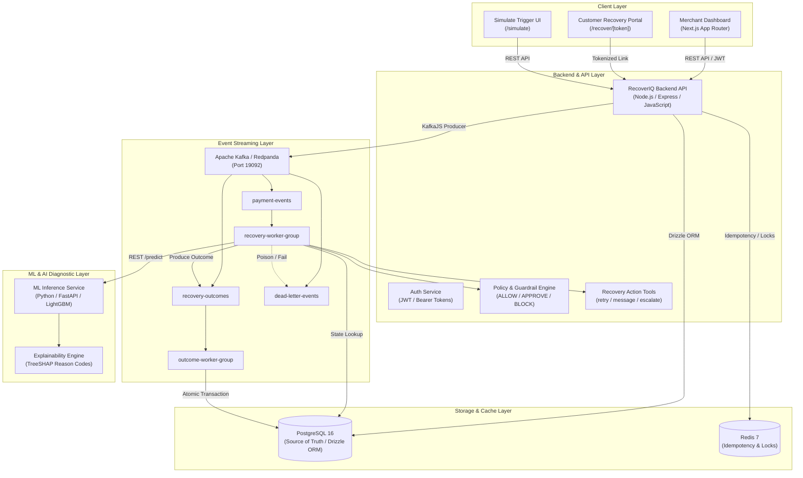
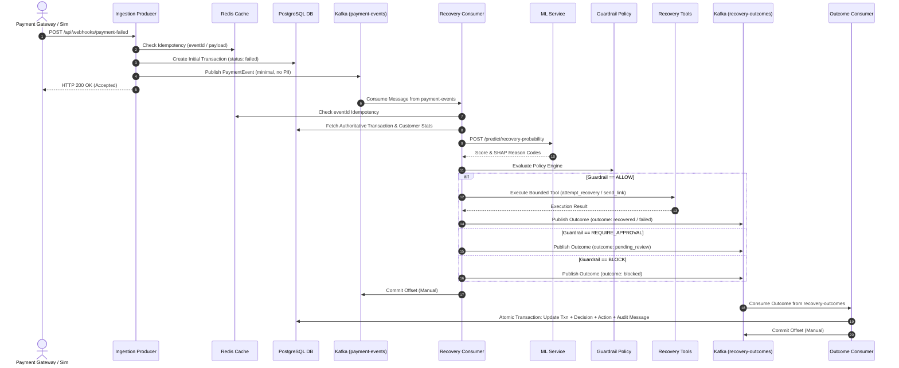
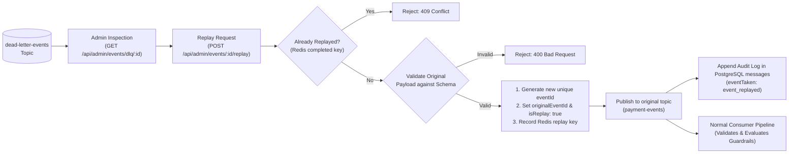
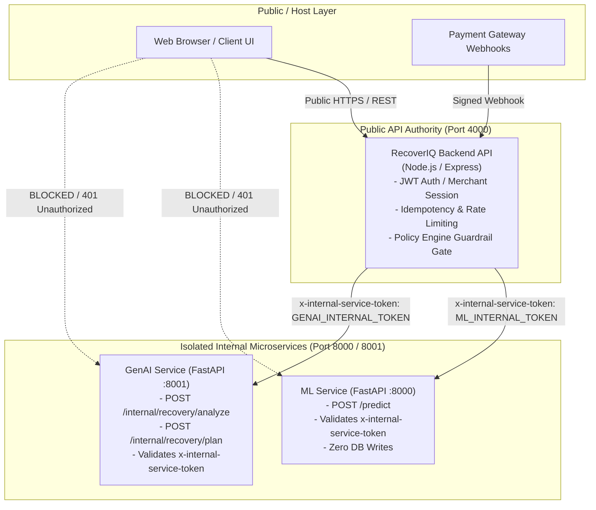

# RecoverIQ — Architecture & System Design Document

This document defines the system architecture, component boundaries, data ownership model, failure handling strategies, and security guarantees for RecoverIQ as implemented in **Phase 4: Event-Driven Architecture with Apache Kafka**.

---

## 1. System Components & Technology Stack



### Technology Matrix
- **Backend API & Workers**: Node.js v22+, Express 4.x (ES Modules), KafkaJS 2.x
- **Event Streaming**: Redpanda (Kafka 3.x compatible)
- **Database & ORM**: PostgreSQL 16, Drizzle ORM 0.38+
- **Cache & Distributed Locks**: Redis 7, `ioredis`
- **Frontend Dashboard & Recovery UI**: Next.js 14, React 18, Tailwind CSS
- **ML Diagnostic Microservice**: Python 3.10+, FastAPI, LightGBM, TreeSHAP
- **Testing**: Node.js native test runner (`node --test`), `node:assert/strict`

---

## 2. Service Boundaries & Data Ownership

| Component | Responsibility | Data Ownership |
|---|---|---|
| **PostgreSQL Database** | Authoritative source of truth for all business state. | Owns `customers`, `transactions`, `decisions`, `actions`, `messages`, `overrides`, `recovery_links`. |
| **Kafka Broker** | Durable, ordered event backbone and transport stream. | Stores serialized event streams with retention. Does **NOT** own relational business state. |
| **Redis Cache** | Short-term distributed locks, rate-limits, and idempotency keys. | Owns `idempotency:*`, `lock:*`, `rate_limit:*`, `dlq:event:*`, and `replay:completed:*` keys with TTLs. |
| **Backend Producer** | Validates incoming webhooks, records initial transaction in DB, publishes minimal event to Kafka, and immediately responds HTTP 200. | Does not execute recovery actions directly. |
| **Recovery Consumer (`recovery-worker-group`)** | Consumes from `payment-events`, loads DB context, runs ML prediction, evaluates guardrails, executes recovery tools, and produces to `recovery-outcomes`. | Reads DB; writes decision records and tool results. |
| **Outcome Consumer (`outcome-worker-group`)** | Consumes from `recovery-outcomes` and executes atomic PostgreSQL reconciliation. | Atomic multi-table writer (`transactions`, `decisions`, `actions`, `messages`). |
| **ML Microservice** | Computes statistical recovery probability and TreeSHAP attribution codes. | Pure inference service; does not write to database. |

---

## 3. End-to-End Event Lifecycle



---

## 4. Failure Handling & Resilience Architecture

### Error Classification Matrix
```
                            Incoming Message
                                   │
                     ┌─────────────┴─────────────┐
                     ▼                           ▼
            Is Payload Malformed?       Is Contract Schema Valid?
              (JSON SyntaxError)            (Zod safeParse)
                     │                           │
                     ├─ Yes ─────────────────────┼─ No
                     ▼                           ▼
            [POISON MESSAGE]            [SCHEMA ERROR]
                     │                           │
                     └─────────────┬─────────────┘
                                   ▼
                      Route Directly to DLQ Topic
                      Commit Offset (Unblock Lag)
```

1. **Poison Messages & Schema Violations**:
   - Immediate routing to `dead-letter-events` topic with `failureType: 'poison_message'` or `'schema_validation_error'`.
   - Consumer commits offset immediately to avoid head-of-line blocking.
2. **Transient Failures (Downstream 5xx, Network Timeout, DB Deadlock)**:
   - Evaluated by `isTransientError()`.
   - Retried with exponential backoff + jitter up to `config.retry.maxRetries` (default: 3).
   - If retries exhaust $\rightarrow$ routed to `dead-letter-events` as `transient_exhausted` and offset committed.
3. **Database Write Ordering / Race Conditions**:
   - If a referenced `transactionId` or `caseId` is not found immediately in PostgreSQL, `executeWithRetry` performs a bounded recheck (3 attempts with 100ms backoff).
   - If the record appears, processing continues smoothly. If still absent after attempts, it routes to DLQ as `database_error`.

---

## 5. Replay Model & Invariants



### Replay Invariants
- **Original DLQ Immutability**: The original dead-letter record in Kafka remains completely unchanged.
- **Traceable Lineage**: Replayed events carry a new unique `eventId` while explicitly referencing `originalEventId` and `replayedFromDlqId`.
- **Zero Bypass**: Replayed events are processed through the standard consumer group, running feature extraction, ML inference, and guardrails.

---

---

## 6. Security Boundaries

1. **Authority Enforcement**: Machine learning models and GenAI agents provide suggestions only. The backend policy engine in Node.js owns all execution authority and security guardrails.
2. **Internal Service Isolation**: Downstream ML (`recoveriq-ml-service`) and GenAI (`recoveriq-genai-service`) microservices are strictly internal and inaccessible to the browser/public network.
3. **Internal Service Authentication**: All inter-service communications (`Backend -> ML`, `Backend -> GenAI`) require a pre-shared cryptographic service token passed via `x-internal-service-token` or `Authorization: Bearer <token>`. Unauthorized requests are rejected with `401 Unauthorized` / `403 Forbidden`.
4. **Admin Authentication**: All replay, review, and DLQ inspection endpoints require valid JWT authentication via `requireMerchantAuth`.
5. **PII Minimization**: Kafka payloads and internal microservice contexts never transmit unnecessary raw customer PII. Workers resolve customer profile data directly from PostgreSQL using opaque keys.

---

## 7. Service Boundary Topology & Token Flow



### Internal Token Configuration
| Environment Variable | Description | Default Dev Secret | Protected Endpoints |
|---|---|---|---|
| `INTERNAL_SERVICE_TOKEN` | Global shared fallback token for internal microservices | `recoveriq-internal-service-token-dev-secret` | All internal APIs |
| `ML_INTERNAL_TOKEN` | Specific token required by `ml-service` | `recoveriq-internal-service-token-dev-secret` | `/predict` |
| `GENAI_INTERNAL_TOKEN` | Specific token required by `genai-service` | `recoveriq-internal-service-token-dev-secret` | `/internal/recovery/*`, `/analyze` |

Health probes (`/health`, `/health/live`, `/health/ready`) remain open to orchestrator health checks without requiring internal tokens.

